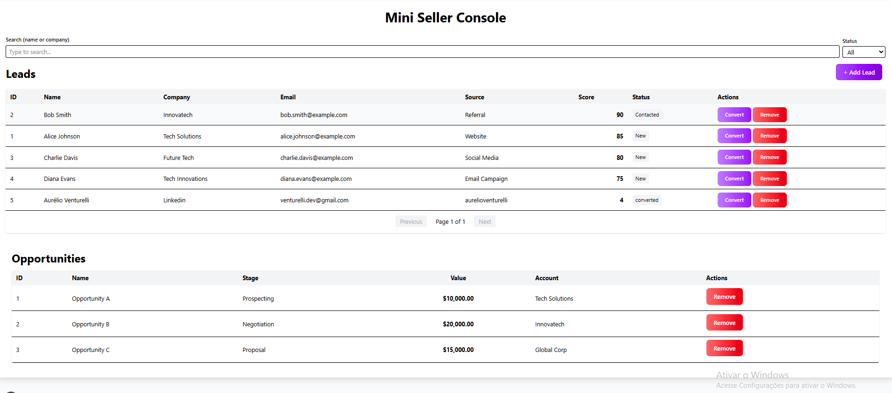
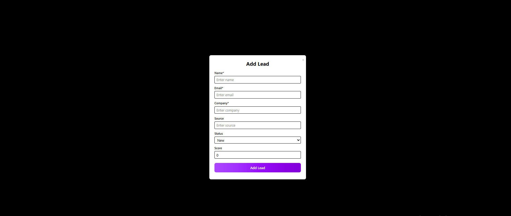

# Mini Seller Console

A comprehensive sales console for managing leads and opportunities with a modern, responsive interface.

## 📸 Screenshots

<div align="center">
  
  
</div>

_Left: Lead management interface | Right: Opportunities tracking view_

## ✨ Key Features

### Lead Management

- **📋 Lead List**: Paginated, searchable table with advanced filtering
- **🔍 Smart Search**: Filter by name, company, and status
- **👤 Lead Details**: Slide-over panel for detailed lead information
- **➕ Add Leads**: Modal form with validation for new lead creation
- **🔄 Lead Conversion**: One-click conversion of qualified leads to opportunities
- **✏️ CRUD Operations**: Full create, read, update, and delete functionality

### Opportunity Management

- **📊 Opportunity Table**: Dedicated view for tracking sales opportunities
- **📈 Stage Tracking**: Monitor opportunity progress through sales pipeline
- **🏢 Account Management**: Associate opportunities with account names

### User Experience

- **📱 Responsive Design**: Optimized for desktop, tablet, and mobile
- **💾 Local Persistence**: Data saved in browser storage
- **🔔 Toast Notifications**: Real-time feedback for all actions
- **🎨 Modern UI**: Clean interface with consistent styling

## 🛠️ Tech Stack

- **Next.js 15** - React framework with App Router
- **React 19** - Frontend library
- **TypeScript** - Type-safe development
- **Tailwind CSS 4** - Utility-first styling
- **Zustand** - State management

## 🚀 Quick Start

```bash
# Install dependencies
npm install

# Run development server
npm run dev

# Open http://localhost:3000
```

## 📁 Project Structure

```
mini_seller/
├── app/src/components/
│   ├── leadList/          # Lead management components
│   ├── leadDetailPanel/   # Lead detail views
│   ├── opportunityTable/  # Opportunity management
│   └── ui/                # Reusable UI components
├── app/src/store/         # Zustand state stores
├── app/src/types/         # TypeScript definitions
└── app/src/hooks/         # Custom React hooks
```

## 🎯 Usage

1. **View Leads**: Browse and search through your lead database
2. **Manage Details**: Click any lead to view/edit information
3. **Convert Leads**: Transform qualified leads into opportunities
4. **Track Opportunities**: Monitor sales pipeline progress
5. **Add New Leads**: Use the modal form to create leads

## 📱 Responsive Breakpoints

- **Desktop**: 1024px+
- **Tablet**: 768px - 1023px
- **Mobile**: 320px - 767px

---

**Mini Seller Console** - Streamlining sales processes with modern web technology.
